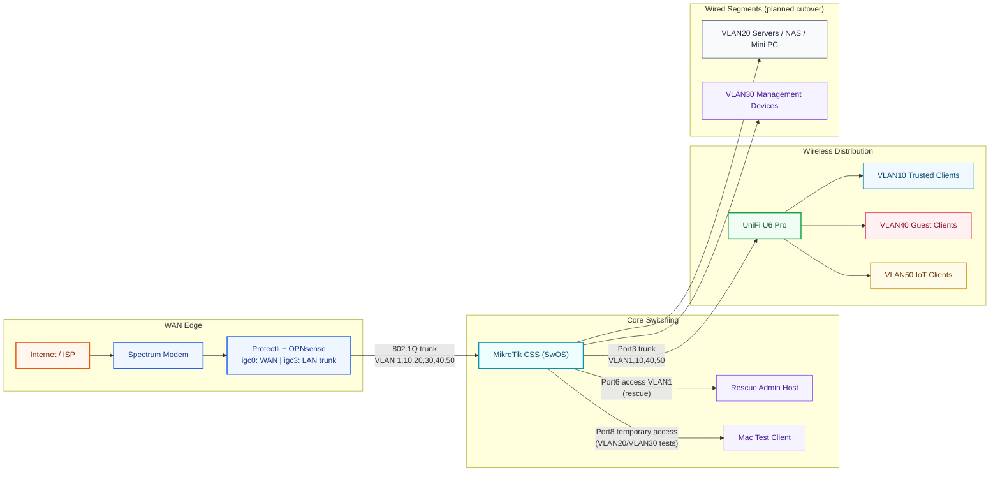

# Physical Network Topology

## Notes
- Port6 stays as the rescue path until all cutovers are validated.
- Port8 is temporary validation only.
- AP management remains on native LAN during transition.
