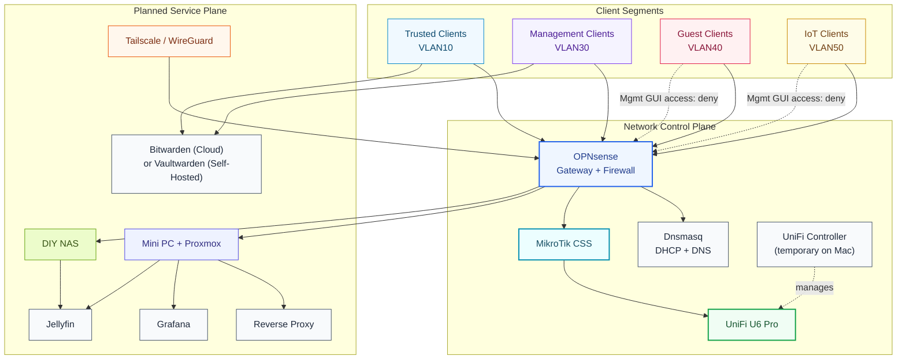

# Service Topology and Trust Boundaries

## Notes
- Remote administration target model is VPN-first (not broad WAN exposure).
- Management GUIs should be reachable only from trusted admin sources.
- Final service placement will be pinned after Proxmox + NAS are online.
- Secrets management plan is Bitwarden cloud first; optional Vaultwarden self-host can be introduced later.
